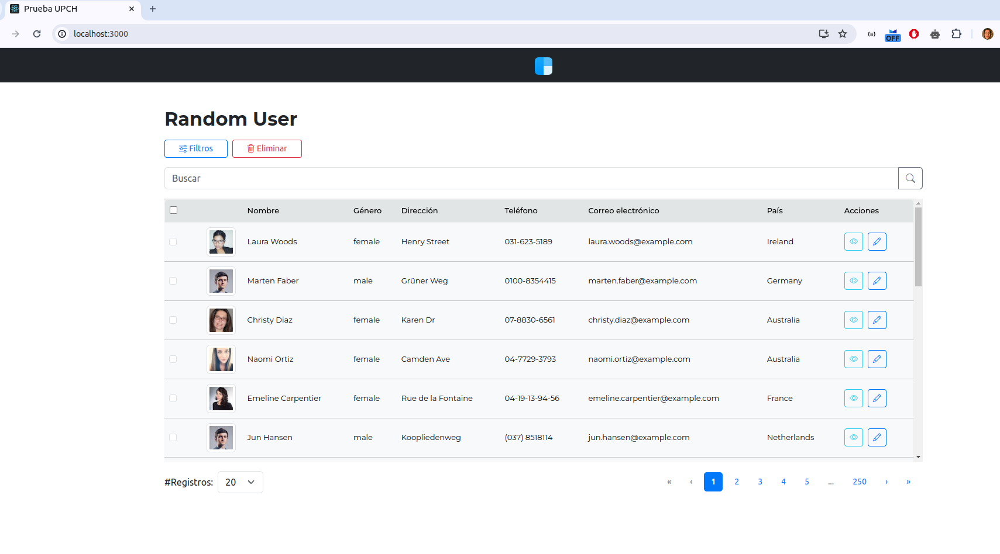
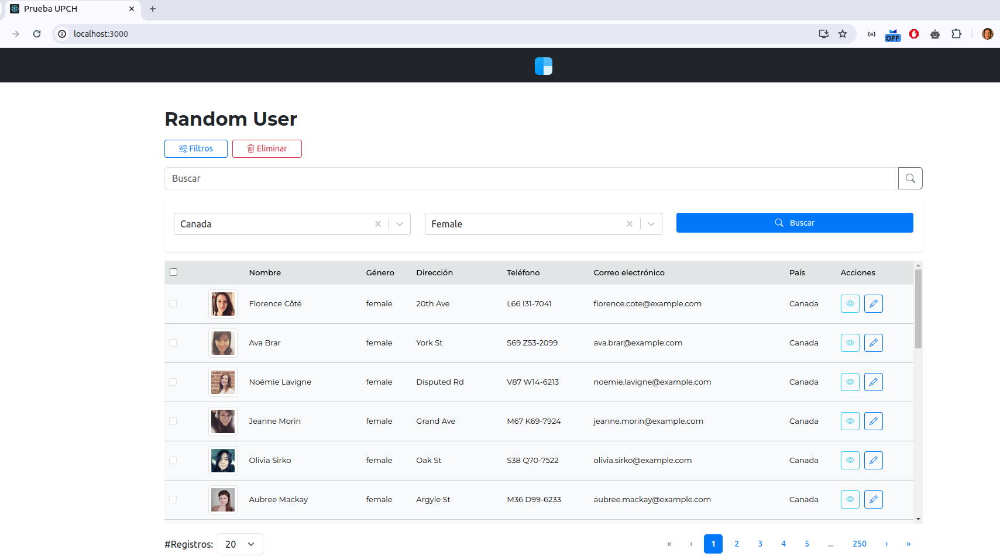
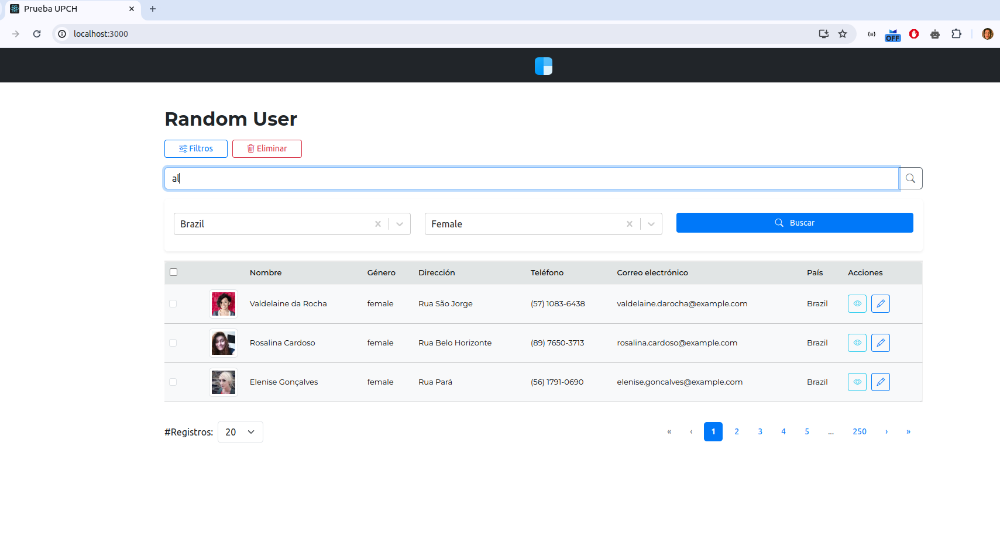
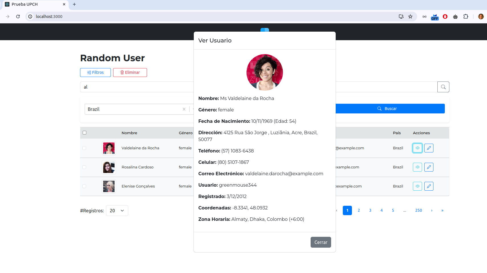
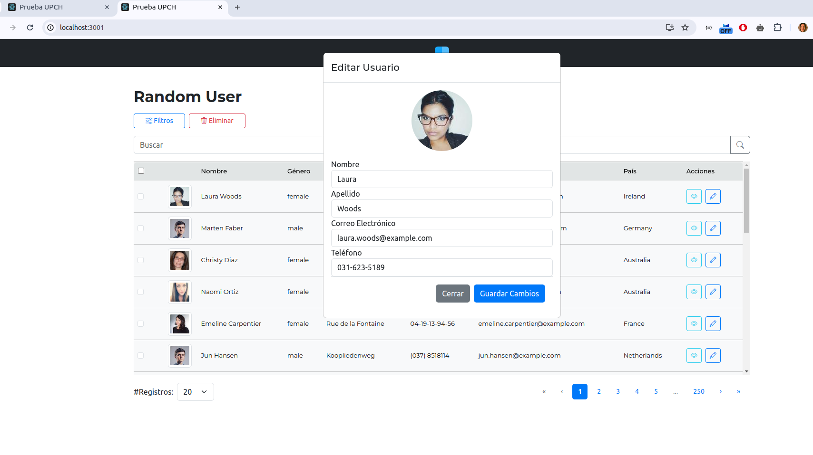

# Random Users


### Requerimientos
```Node v.18.17.0+```
### Instalación
```npm install```
### Run
`npm start`

Runs the app in the development mode.\
Open [http://localhost:3000](http://localhost:3000) to view it in the browser.

## Features

1. **User Data Table**
   - Muestra una tabla de usuarios con información detallada como nombre, género, dirección, teléfono, correo electrónico y país.
    - Soporte para mostrar imágenes de perfil de los usuarios..

2. **Filtering and Search**
   - Permite filtrar usuarios por género y nacionalidad utilizando un componente de filtros.
    - Barra de búsqueda para filtrar usuarios por nombre (nombre o apellido).
    - Actualización dinámica de los resultados basados en los filtros y la búsqueda sin necesidad de recargar la página.

3. **Pagination**
    - Soporte para la paginación de los resultados con control sobre el número de resultados por página.
    - Paginador responsivo para facilitar la navegación entre múltiples páginas de resultados.

4. **Select All and Bulk Actions**
   - Selección de múltiples usuarios mediante casillas de verificación.
    - Acción de eliminar múltiples usuarios seleccionados.

5. **Responsive Design**
   - Diseño responsivo que se adapta a diferentes tamaños de pantalla.
    - Scroll horizontal y vertical para manejar tablas grandes en dispositivos móviles.
6. **Modals for Viewing and Editing**
    - Modal para ver información detallada del usuario seleccionado.
    - Modal para editar la información del usuario seleccionado.
    - Guardado de los cambios realizados en la información del usuario.

7. **Skeleton Loader**
   - Indicador de carga (skeleton) que muestra un estado de carga mientras se obtienen los datos.


8. **Action Buttons**
   - Botones para abrir el filtro, editar y eliminar usuarios.
    - Diseño de botones con iconos para mejorar la interfaz de usuario.

9. **State Management**
   - Manejo del estado de filtros, búsqueda, paginación, selección de usuarios y modificaciones mediante hooks de React.
    - Custom hook useUsers para la obtención de datos de usuarios con soporte para filtros y paginación.

10. **Utilities**
    - Mapeo de códigos de país a nombres completos de países para mostrar nombres amigables en la tabla.

## Filter

## Search Bar

## Ver Usuario

## Editar Usuario



